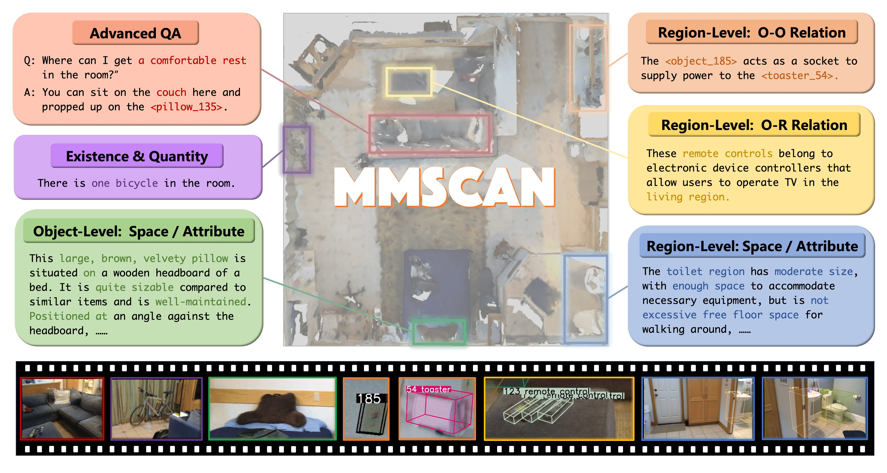

# My-Perception:
## Introduction

The My-Perception repository focuses on embodied perception, covering both benchmarks and models for embodied scene understanding and reasoning. Currently, it includes:
### Models
- [LLaVA-3D](https://zcmax.github.io/projects/LLaVA-3D/)
### Benchmaeks
- [MMScan](https://tai-wang.github.io/mmscan/), [OST-Bench](https://rbler1234.github.io/OSTBench.github.io/), [MMSI-Bench](https://runsenxu.com/projects/MMSI_Bench/), and EgoExo-Bench.

## What's New

### Highlight
2025/7 - The first version of My-Perception includes the model LLaVA-3D, and benchmarks MMScan, OST-Bench, MMSI-Bench, and EgoExo-Bench.

## Overview of My-Perception Models
### LLaVA-3D

## Overview of My-Perception Benchmarks

| Benchmark       | Domain                | Tasks                                                   | Input Modality                                       | Data Split & Scale                                     | Access                                      |
|-----------------|-----------------------|----------------------------------------------------------|------------------------------------------------------|--------------------------------------------------------|---------------------------------------------|
| `MMScan`        | Scene Understanding      | Visual Grounding, Question Answering | `point cloud`, `image`, `video`, `text`              | Train/Val/Test, 3M  | [Code](#) / [Data](#) / [Eval](#)           |
| `OST-Bench`     | Scene Spatial Reasoning          | Online Question Answering         | `video`, `text`                                      | Test,10k    | [Code](#) / [Data](#) / [Eval](#)           |
| `MMSI-Bench`    | Scene Spatial Reasoning       | Question Answering                     | `image`, `text`                      | Test,1k    | [Code](#) / [Data](#) / [Eval](#)           |
| `EgoExo-Bench`  | Scene Spatial Reasoning | Question Answering                       | `video`,  `text`                             | Test, 5k          | [Code](#) / [Data](#) / [Eval](#)           |

## MMScan: A Multi-Modal 3D Scene Dataset with Hierarchical Grounded Language Annotations
[**🌐 Homepage**](https://tai-wang.github.io/mmscan/)  | [**💻 Code&Dataset**](https://github.com/OpenRobotLab/EmbodiedScan/tree/mmscan)  | [**📖 arXiv**](https://arxiv.org/abs/2406.09401)

### **Description :**

MMScan is the **first** largest ever multi-modal 3D scene dataset and benchmark with hierarchical grounded language annotations designed to advance embodied perception. It addresses the limitations of existing datasets by introducing hierarchical, grounded language annotations that span regions, objects, and inter-object relationships. Built with VLM-assisted annotation and human refinement, MMScan contains 1.4M captions across 109k objects and 7.7k regions, supporting over 3.04M samples for Visual Grounding and Question Answering tasks. Extensive benchmarking reveals key challenges and shows that training on MMScan significantly boosts model performance in both standard and real-world settings.

### **Input Modalities :** `🌐 Point Cloud` `🖼️🎞️ image/video` `💬 text`

### **Tasks in MMScan :**
| Task Name              | Input Format                             | Output Format                               | Evaluation Metrics                  |
|------------------------|---------------------------------------------|---------------------------------------------|-------------------------------------|
| 3D Visual Grounding    | `point cloud`/`rgbd images`+`text prompt`                               | `List [3d bounding boxes]`                           | **gTop-k**, AP, AR, AP_C, AR_C                          |
| 3D Question Answering  | `point cloud`/`rgbd images`+`text prompt`(+`List [3d bounding boxes]`)                      | `text response`          | **GPT-score**, EM , Bleu-X, Meteor, CIDEr, SPICE, SimCSE, SBERT                             |

### **Dataset Statics**
MMScan covers both *Inter-target and Single-target* cases, spans two reasoning aspects: *Spatial and Attribute*, and operates at both the *Object and Region levels*.

For the Question Answering task, the dataset contains 1M training samples, 300k validation samples, and 300k test samples. For Visual Grounding, the training/validation/test split includes 850k, 200k, and 200k samples respectively.

    

### **Access**
The code and data for MMScan are located under `./benchmarks/MMScan`.
This directory includes instructions for data download, as well as the mmscan-devkit tools for data loading and evaluation, along with comprehensive documentation.

## OST-Bench: Evaluating the Capabilities of MLLMs in Online Spatio-temporal Scene Understanding
[**🌐 Homepage**](https://rbler1234.github.io/OSTBench.github.io/)  | [**💻 Code&Dataset**](https://github.com/rbler1234/OST-Bench)  | [**📖 arXiv**](https://arxiv.org/abs/<>)

    

### **Description :**

Recent advances in multimodal large language models (MLLMs) have shown remarkable capabilities in integrating vision and language for complex reasoning. While most existing benchmarks evaluate models under offline settings with a fixed set of pre-recorded inputs, we introduce OST-Bench, a benchmark designed to evaluate Online Spatio-Temporal understanding from the perspective of an agent actively exploring a scene. The **Online** aspect emphasizes the need to process and reason over incrementally acquired observations, while the **Spatio-Temporal** component requires integrating current visual inputs with historical memory to support dynamic spatial reasoning. OST-Bench better reflects the challenges of real-world embodied perception. 

### **Input Modalities :** `🎞️ video` `💬 text`

### **Tasks in OST-Bench :**
| Task Name              | Input Format                             | Output Format                               | Evaluation Metrics                  |
|------------------------|---------------------------------------------|---------------------------------------------|-------------------------------------|
| Question Answering    | `rgb video`+`question`(+`options`)                               | `string`/`int`/`float`                           | `EM(string)`/`EM(int)`/`MRA`                         |

### **Dataset Statics**
OST-Bench categorizes questions into three main types: *Agent State*, *Agent-Object Spatial Relationship*, and *Agent Visible Information*, which are further divided into 15 specific subtypes (as shown in the figure).

It covers 1.4K multi-turn dialogues across scenes from ScanNet, Matterport3D, and ARKitScenes, resulting in a total of 10,000 question-answer pairs used as the test set for this benchmark.

    

### **Access**
The code and data for OST-Bench are located under `./benchmarks/MMScan`.
This directory includes instructions for data download, as well as the evaluation tools along with comprehensive documentation. OST-Bench is also integrated with [VLMEvalKit](https://github.com/open-compass/VLMEvalKit/tree/main), enabling standardized evaluation within the framework.

## MMSI-Bench: A Benchmark for Multi-Image Spatial Intelligence
[**🌐 Homepage**](https://runsenxu.com/projects/MMSI_Bench/)  | [**💻 Code&Dataset**](https://github.com/OpenRobotLab/MMSI-Bench)  | [**📖 arXiv**](https://arxiv.org/abs/2505.23764)

    

### **Description :**
MMSI-Bench possesses the following unique features:
1. **Multi-image.** We target multi-image spatial reasoning: each of the ten fundamental tasks involves two images, while the multi-step reasoning tasks use more.
2. **High quality.** Every question is fully human-designed—selecting images, crafting questions, carefully designing distractors, and annotating step-by-step reasoning processes.
3. **Aligned with real-world scenarios.** All images depict real-world scenes from domains such as autonomous driving, robotic manipulation, and scene scanning, and every question demands real-world scene understanding and reasoning. We do not use any synthetic data.
4. **Comprehensive and challenging.** We benchmark 34 MLLMs—nearly all leading proprietary and open-source models—and observe a large gap between model and human performance. Most open-source models perform at roughly random-choice level. To the best of our knowledge, our benchmark shows the largest reported model-human gap.
5. **Reasoning processes.** Each sample is annotated with a step-by-step reasoning trace that justifies the correct answer and helps diagnose model errors.

### **Input Modalities :** `🖼️ image` `💬 text`

### **Tasks in OST-Bench :**
| Task Name              | Input Format                             | Output Format                               | Evaluation Metrics                  |
|------------------------|---------------------------------------------|---------------------------------------------|-------------------------------------|
| Question Answering    | `rgb image`+`question`+`options`                               | `string`                           | `EM(string)`                         |

### **Dataset Statics**
MMSI-Bench categorizes tasks around three core spatial elements: camera, object, and region, focusing on their positional relationships, attributes, and motion. There are six types of positional relationships: camera-camera, camera-object, camera-region, object-object, object-region, and region-region. The benchmark also includes two types of attributes (measurement and appearance), two types of motion (camera and object), and one multi-step reasoning category. 

Annotated by six 3D vision researchers from diverse real-world scene images, it includes 1,000 challenging questions used as the test set.

    

### **Access**
The code and data for MMSI-Bench are located under `./benchmarks/MMScan`.
This directory includes instructions for data download, as well as the evaluation tools along with comprehensive documentation. MMSI-Bench is integrated with [VLMEvalKit](https://github.com/open-compass/VLMEvalKit/tree/main), enabling standardized evaluation within the framework.